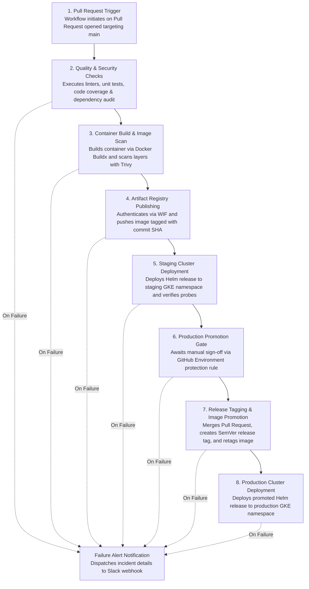
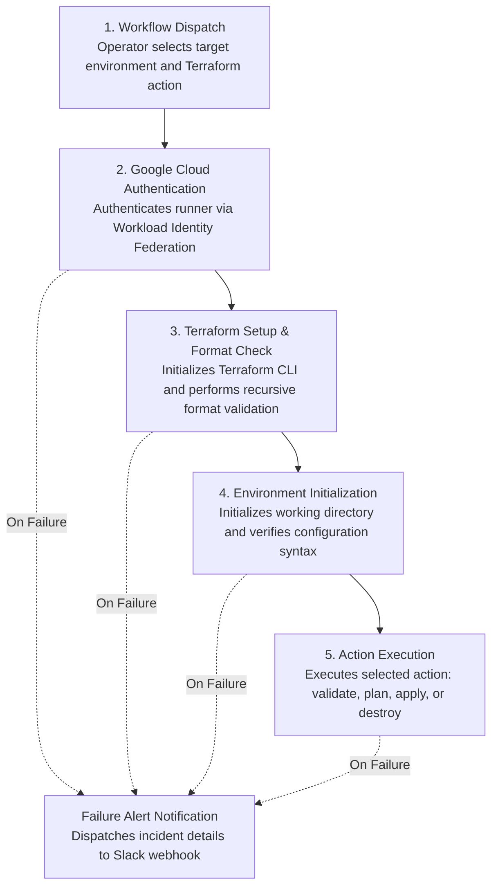

# GCP Infrastructure, CI/CD Automation, and Platform Engineering

This repository contains the Terraform Infrastructure as Code (IaC), Kubernetes Helm deployments, GitHub Actions CI/CD workflows, and Cloud Monitoring architecture for deploying a containerized microservice on Google Cloud Platform (GCP).

---

## Table of Contents
- [Architecture Overview](#architecture-overview)
- [Repository Structure](#repository-structure)
- [Infrastructure as Code (Terraform)](#infrastructure-as-code-terraform)
- [CI/CD Workflows & Automation](#cicd-workflows--automation)
- [Observability, Centralized Logging & Alerting](#observability-centralized-logging--alerting)
- [Security, Secret Management & Backup Strategy](#security-secret-management--backup-strategy)

---

## Architecture Overview

The system uses a private, multi-tier Google Cloud architecture provisioned across isolated Staging and Production environments:

```
                            [ Public Internet ]
                                     |
                             (HTTPS / Port 443)
                                     v
                   [ Google Cloud HTTP(S) Load Balancer ]
                                     |
                                     v
+---------------------------------------------------------------------------+
| GCP Virtual Private Cloud (VPC)                                           |
|                                                                           |
|  +--------------------------------+     +------------------------------+  |
|  | Private Subnet                 |     | Private Services Access (PSA)|  |
|  |                                |     |                              |  |
|  |  GKE Cluster                   |     |  Cloud SQL                   |  |
|  |  - FastAPI Microservice Pods   |====>|  - PostgreSQL 15 Instance    |  |
|  |  - Private IP Ranges           |     |  - Private IP (Port 5432)    |  |
|  +--------------------------------+     +------------------------------+  |
+---------------------------------------------------------------------------+
```

---

## Repository Structure

```
.
├── .github/
│   └── workflows/
│       ├── cicd.yml             # Single-run PR workflow: Build, Test, Scan, Deploy Staging, Gate & Deploy Prod
│       └── infra.yml            # Manual Terraform workflow (workflow_dispatch: validate, plan, apply, destroy)
├── terraform/
│   ├── environments/
│   │   ├── staging/             # Staging root module (main.tf, variables.tf, terraform.tfvars, outputs.tf)
│   │   └── prod/                # Production root module (main.tf, variables.tf, terraform.tfvars, outputs.tf)
│   └── modules/
│       ├── vpc/                 # Custom VPC, subnets, GKE secondary ranges, Cloud NAT, and firewall rules
│       ├── gke/                 # VPC-native private GKE cluster, autoscaling node pool, namespace & secret
│       ├── cloudsql/            # Cloud SQL PostgreSQL 15, private IP peering, automated backups & PITR
│       ├── iam/                 # Service accounts, Workload Identity, and shared Artifact Registry access
│       └── monitoring/          # Cloud Monitoring dashboards (Golden Signals, Infra/DB) and alert policies
├── helm/
│   └── test-app/
│       ├── Chart.yaml           # Helm chart definition
│       ├── values-staging.yaml  # Staging Helm values
│       ├── values-prod.yaml     # Production Helm values
│       └── templates/           # Kubernetes manifests (Deployment, Service, Ingress, BackendConfig, SA)
├── app/
│   ├── Dockerfile               # Multi-stage container build running as unprivileged user (UID 10001)
│   ├── database.py              # SQLAlchemy database engine, connection pooling, and NumberEntry ORM model
│   ├── main.py                  # FastAPI application with REST endpoints, UI routes, /healthz, and /readyz probes
│   ├── requirements.txt         # Production runtime dependencies
│   └── templates/
│       └── index.html           # HTML template for web UI
└── tests/
    ├── requirements-test.txt    # Testing dependencies (pytest, pytest-cov, black, flake8, pip-audit)
    ├── test_app.py              # Unit tests for application endpoints and health probes
    └── test_integration.py      # Integration tests for database CRUD workflows
```

---

## Infrastructure as Code (Terraform)

All GCP resources are provisioned via modular Terraform code. Environments are decoupled into `terraform/environments/staging` and `terraform/environments/prod`, with configuration values driven by `variables.tf` and `terraform.tfvars`.

### Terraform Module Breakdown
1. **VPC Module (`terraform/modules/vpc`)**:
   - Provisions a custom VPC network (`auto_create_subnetworks = false`).
   - Provisions public and private subnets with secondary IP ranges for GKE Pods and Services.
   - Configures Cloud Router and Cloud NAT for private GKE nodes to access external registries and APIs.
   - Creates firewall rules for internal subnet traffic, GCP health check probes (`35.191.0.0/16`, `130.211.0.0/22`), and GKE master-to-node communication.
2. **GKE Module (`terraform/modules/gke`)**:
   - Provisions a VPC-native private GKE cluster with default node pool removed.
   - Provisions an autoscaling managed node pool with GKE Workload Identity enabled (`workload_metadata_config.mode = "GKE_METADATA"`).
   - Enforces shielded nodes, private nodes (`enable_private_nodes = true`), and rolling node upgrades.
   - Provisions the application Kubernetes namespace (`app-stg` / `app-prd`) and the `db-credentials` Kubernetes secret directly within the cluster after node pool creation.
3. **Cloud SQL Module (`terraform/modules/cloudsql`)**:
   - Reserves a global internal IP range for VPC peering (`purpose = "VPC_PEERING"`).
   - Establishes a Private Services Access (PSA) connection to `servicenetworking.googleapis.com`.
   - Provisions a PostgreSQL 15 instance with private IP only (`ipv4_enabled = false`), automated backups, PITR, Query Insights, and database connection/disconnection logging.
   - Generates random credentials via `random_password` for injection into the cluster.
4. **IAM Module (`terraform/modules/iam`)**:
   - Creates a dedicated GKE node service account with local logging and monitoring permissions.
   - Uniformly grants cross-project reader permissions (`roles/artifactregistry.reader`) to GKE worker nodes on the pre-created shared Artifact Registry repository (`cicd-shared-gar-627e/ar-usc1-test-app`) across both Staging and Production.
   - Creates an application service account with `roles/cloudsql.client`.
   - Binds the Kubernetes ServiceAccount to the GCP ServiceAccount via `roles/iam.workloadIdentityUser`.
5. **Monitoring Module (`terraform/modules/monitoring`)**:
   - Provisions Cloud Monitoring dashboards (Application Golden Signals, Infrastructure & Database Health).
   - Conditionally provisions Cloud Monitoring alert policies when `enable_alerts = true`.

---

## CI/CD Workflows & Automation

### 1. Application Continuous Delivery Pipeline (`.github/workflows/cicd.yml`)

The application deployment pipeline executes automatically on Pull Requests targeting `main` (when changes touch `app/**`, `tests/**`, or `helm/**`) and runs as a single continuous delivery workflow:



#### Pipeline Jobs:
1. **`build-and-test`**:
   - **Code Quality & Formatting**: Validates code formatting with Black and enforces PEP8 style guidelines with Flake8.
   - **Automated Testing & Coverage**: Executes unit and integration test suites via Pytest with code coverage tracking.
   - **Dependency Vulnerability Scanning**: Audits runtime Python dependencies for known CVEs using pip-audit.
   - **Container Build & Security Scan**: Builds container images via Docker Buildx and scans layers for vulnerabilities using Trivy.
   - **Artifact Registry Publishing**: Authenticates securely via Workload Identity Federation (WIF) and pushes the verified container image to the shared Artifact Registry repository tagged with the commit SHA.
2. **`deploy-staging`**:
   - Authenticates to the staging GKE cluster (`gke-usc1-staging`) using Workload Identity Federation.
   - Deploys the staging Helm release to the staging application namespace (`app-stg`) with the commit SHA image tag.
   - Verifies rollout completion and readiness probes before proceeding.
3. **`approve-production-promotion`**:
   - Pauses execution at a manual approval gate requiring sign-off from authorized reviewers via GitHub Environment protection rules.
   - Automatically approves and merges the Pull Request into the `main` branch upon approval.
   - Generates the next Semantic Version tag (patch release bump) and pushes the new Git tag.
   - Retags the tested staging image in the shared Artifact Registry with the semantic release tag and `latest`.
4. **`deploy-production`**:
   - Authenticates to the production GKE cluster (`gke-usc1-prod`) using Workload Identity Federation.
   - Deploys the promoted release image to the production application namespace (`app-prd`) using production Helm values.
5. **`notify-on-failure`**:
   - Dispatches an automated Slack webhook alert containing repository, branch, author, commit SHA, and run URL whenever any stage fails.

---

### 2. Infrastructure Automation Workflow (`.github/workflows/infra.yml`)

The infrastructure workflow is triggered manually via **`workflow_dispatch`** in the GitHub Actions UI:



- **Inputs**:
  - `environment`: Target deployment environment (`staging` or `prod`).
  - `action`: Terraform action to execute (`validate`, `plan`, `apply`, or `destroy`).
- **Execution Pipeline**:
  - Authenticates to Google Cloud via Workload Identity Federation (WIF).
  - Configures the Terraform CLI toolchain.
  - Verifies Terraform syntax and recursive formatting across all files.
  - Initializes working directory (local state mode for validation, Google Cloud Storage remote backend for execution).
  - Validates configuration syntax and module declarations.
  - Executes the requested action (`plan`, `apply`, or `destroy`) against the target environment.
  - Dispatches an automated Slack webhook notification if any step fails.

---

## Observability, Centralized Logging & Alerting

### Cloud Monitoring Dashboards (`terraform/modules/monitoring/main.tf`)
1. **Application Golden Signals Dashboard**:
   - **HTTP Request Rate (RPS)**: Request throughput rate per second aligned over 60s windows, grouped by response code class (`loadbalancing.googleapis.com/https/request_count`).
   - **HTTP Error Rate (4xx & 5xx)**: Stacked bar chart tracking client errors (4xx) and backend server errors (5xx).
   - **Latency (p50, p95, p99)**: End-to-end request duration percentiles (`loadbalancing.googleapis.com/https/total_latencies`).
   - **Application Pod Restarts**: Container restart counter detecting crashloops and OOM kills (`kubernetes.io/container/restart_count`).
2. **Infrastructure & Database Health Dashboard**:
   - **GKE Node CPU & Memory Utilization**: Allocatable resource saturation per node VM (`kubernetes.io/node/...`).
   - **Cloud SQL CPU Utilization**: Compute saturation on PostgreSQL (`cloudsql.googleapis.com/database/cpu/utilization`).
   - **Cloud SQL Active Database Connections**: Real-time count of active database sessions (`cloudsql.googleapis.com/database/postgresql/num_backends`).

### Production Alert Policies
Configured exclusively in production (`enable_alerts = true`) with variable threshold values:
- **5xx HTTP Error Rate**: Fires if 5xx errors exceed threshold (`error_count_threshold`, default: 10) in 5 minutes.
- **Latency Spikes**: Fires if p95 latency exceeds threshold (`latency_threshold_ms`, default: 2000ms) in 5 minutes.
- **GKE Node High CPU**: Evaluates each worker node independently; fires if any single node CPU exceeds threshold (`node_cpu_threshold`, default: 85%) for 5 minutes.
- **Database High CPU**: Fires if PostgreSQL CPU exceeds threshold (`cloudsql_cpu_threshold`, default: 80%) for 5 minutes.
- Connects to an optional email notification channel via `notification_email`.

### Centralized Logging Streams
- **Load Balancer Access Logs**: Enabled on Cloud Load Balancer BackendConfig with `sampleRate: 1.0`.
- **System & Application Logs**: Captured by GKE logging agents and streamed to Google Cloud Logging.
- **Database Query Logs**: Cloud SQL configured with `log_connections = on`, `log_disconnections = on`, and `log_min_duration_statement = 1000` (capturing queries slower than 1 second).

---

## Security, Secret Management & Backup Strategy

### Secret Management
- **Zero Static Credentials in Code**: No database passwords or keys exist in source code, Helm values, or container layers.
- **Native Kubernetes Secret**: Database credentials generated via Terraform `random_password` (24-character entropy) are provisioned directly as a `kubernetes_secret` (`db-credentials`) in the application namespace (`app-stg` / `app-prd`).
- **Pod Environment Injection**: Pods read `DB_PASSWORD` securely via `secretKeyRef` from the Kubernetes Secret at runtime.
- **Private Database Network**: Cloud SQL has `ipv4_enabled = false` and is accessible only through internal VPC peering.

### Backup and Disaster Recovery Strategy
- **Automated Daily Backups**: Daily disk snapshots run automatically at 02:00 UTC with a 7-day retention window. Backups are stored in Google Cloud-managed regional object storage, physically separated from the database VM instance.
- **Point-in-Time Recovery (PITR)**: PostgreSQL Write-Ahead Logs (WAL) are retained for 7 days in Google Cloud-managed storage, allowing granular database recovery to any specific second.
- **Regional High Availability**: Production runs cross-zone synchronous replication (`availability_type = "REGIONAL"`) with automatic failover.
- **Deletion Protection**: Guarded with `deletion_protection = true` in Production.
